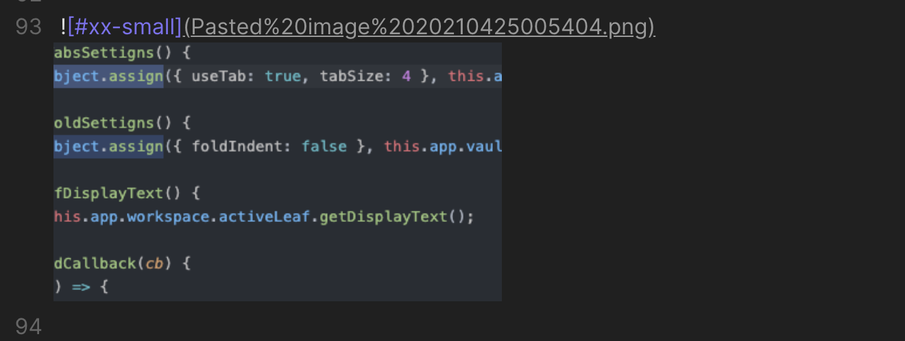
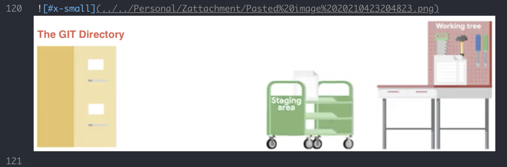
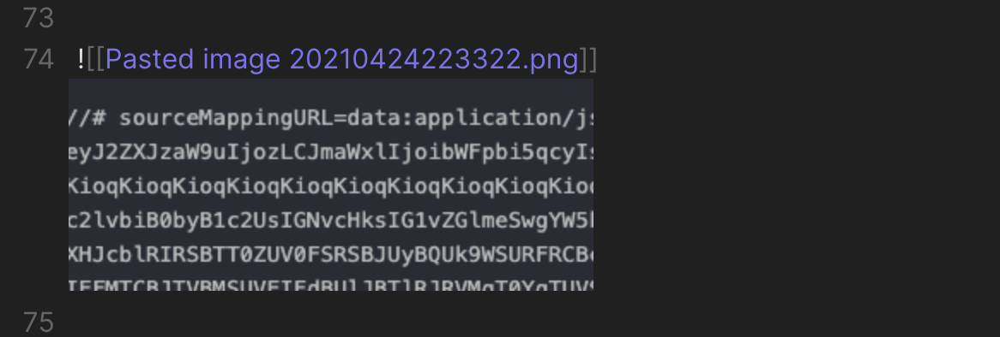
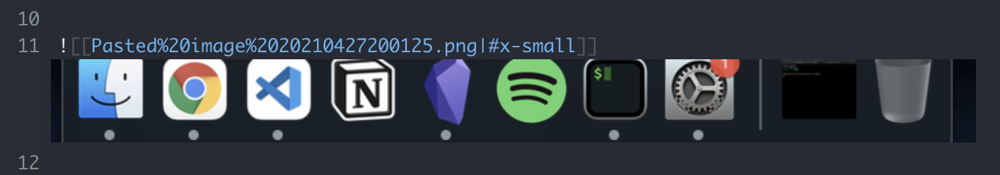

# Ozan's Image in Editor Plugin

## Brief Explanation

Because I always prefer seeing the images directly under the link when I paste or drag images into my Markdown notes, I developed a plugin for myself to view images directly under the Editor view.

## Formats Supported

- **!( ALT-TEXT )[ IMAGE-NAME ]**
**Example**: !( #x-small )[ myimage.png ]

- **!\[[ IMAGE-NAME | ALT-TEXT ]]**
**Example**: !\[[ myimage.png | #x-small ]]

- **!\[[ IMAGE-NAME ]]**
**Example**: !\[[ myimage.gif ]]

**Scanned Image Formats** : jpg, jpeg, png, gif, svg, bmp

## Sample Views

### *Markdown Format*

### *Wikilinks format*

## Image View Size

Relative and Absolute Path will give you possibility to add "alt" text for the image. You can decide about the size of the image using following 
alt texts:

1. #small
2. #x-small
3. #xx-small

## Contact

If you have any issue or you have any suggestion, please feel free to reach me out directly using contact page of my website [ozan.pl/contact/](https://www.ozan.pl/contact/) or directly to <me@ozan.pl>.

## Checklist

Plugin was tested on:

- [x] Windows
- [x] macOS
- [ ] Linux

## Support

