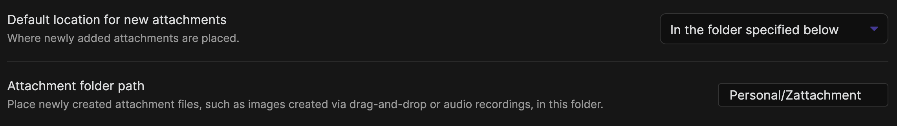
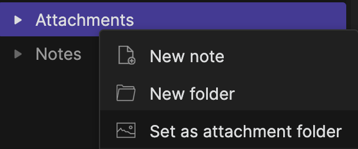
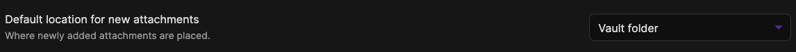

# Ozan's Image in Editor Plugin

## Brief Explanation

Because I always prefer seeing the images directly under the link when I paste or drag images into my Markdown notes, I developed a plugin for myself to view images directly under the Editor view.

## Requirement & Samples

- Users needs to use one of settings below to be able to view the images properly in the Editor view. It will ensure that plugin is able to generate the image source link correctly:

### 1 - First Option (Specified Folder)

*Files & Links --> Attachment Folder --> In the folder specified below*

You can set the attachment folder using the right click under tree view:

### 2 - Second Option (Vault Folder)

*Files & Links --> Attachment Folder --> Vault*

## Sample Views

- *Markdown Format*

- *Wikilinks format*

## Image View Size

Relative and Absolute Path will give you possibility to add "alt" text for the image. You can decide about the size of the image using following 
alt texts:

1. #small
2. #x-small
3. #xx-small

## Contact

If you have any issue or you have any suggestion, please feel free to reach me out directly using contact page of my website [ozan.pl/contact/](https://www.ozan.pl/contact/) or directly to <me@ozan.pl>.

## Checklist

Plugin was tested on:

- [x] Windows
- [x] macOS
- [ ] Linux

## Planned Updates

- [ ] Any attachment folder as long as the absolute path is selected
- [ ] Mobile Support

## Support

