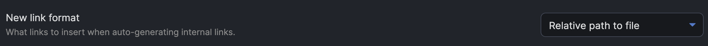
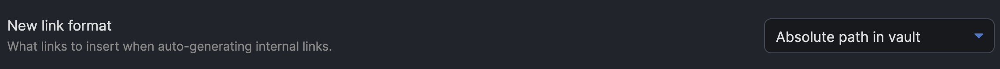

# Ozan's Image in Editor Plugin

## Brief Explanation

Because I always prefer seeing the images directly under the link when I write my notes in Markdown, I developed a plugin for myself to view images directly under the Editor view. 

## Requirement & Samples

Users needs to use one of settings below to be able to view the images properly in the Editor view. It will ensure that plugin is able to generate the image source link correctly.

### 1- First Option: 
*New Link Format -> Relative path to file*

**View:**

### 2 - Second Option: 
*New Link Format -> Absolute path in vault*

**View:**

### 3- Third Option: 
*New Link Format -> Shortest Path Possible* 
and 
*Default location for new attachments -> Vault Folder*

**View:**

## Image View Size

Relative and Absolute Path will give you possibility to add "alt" text for the image. You can decide about the size of the image using following 
alt texts:

1. #small
2. #x-small
3. #xx-small

If you have any issue or you have any suggestion, please feel free to reach me out directly using <me@ozan.pl>

## Checklist

Plugin was tested on:

- [x] Windows
- [x] macOS
- [ ] Linux